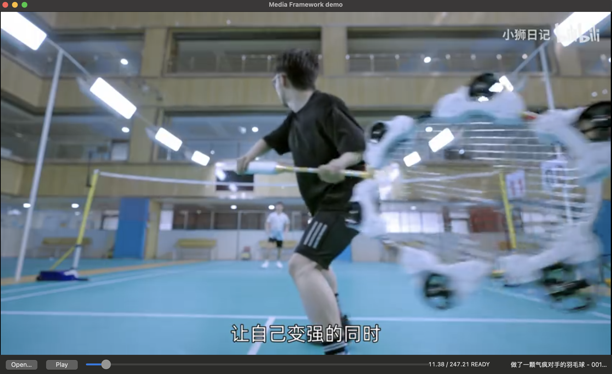
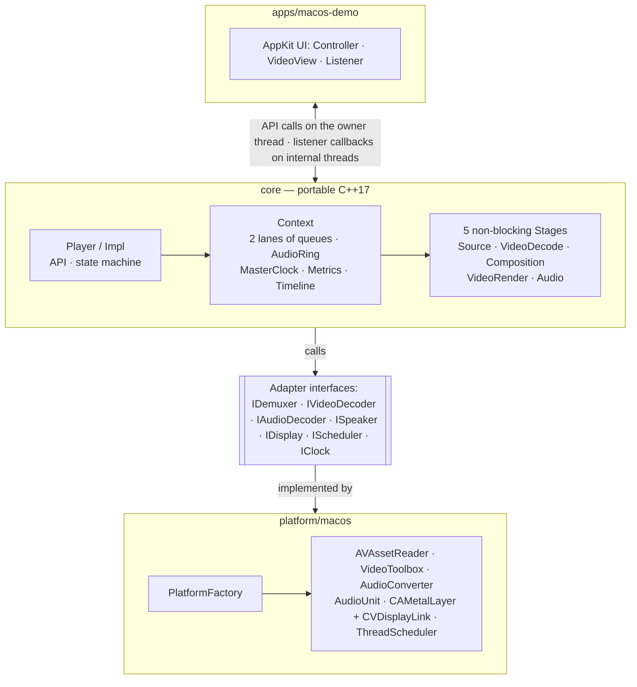
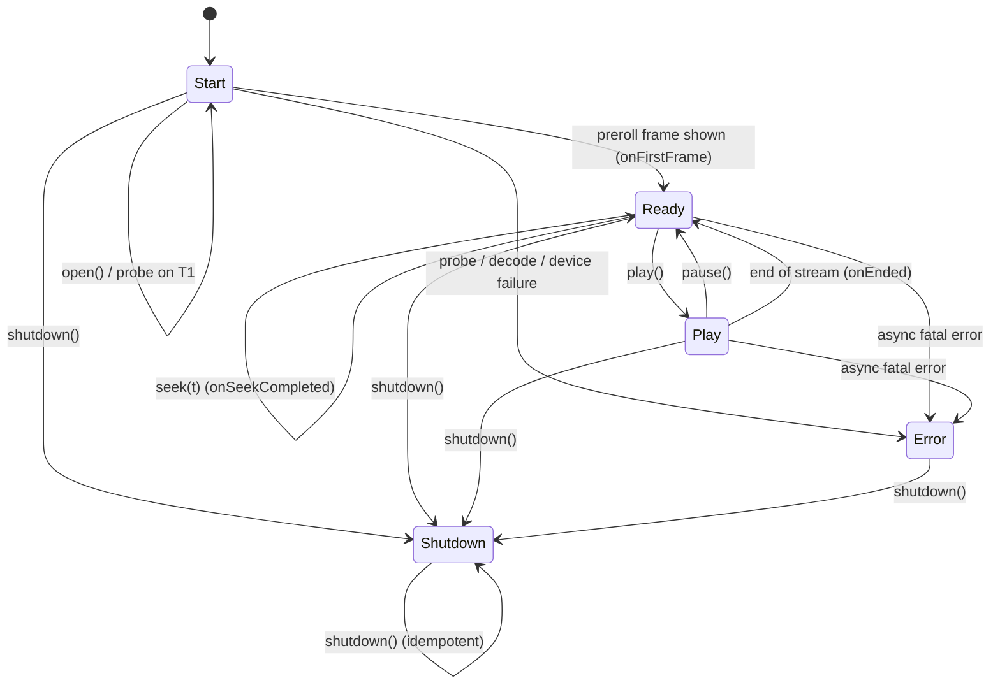

# Media Framework

This is a portable C++ media playback core with native platform adapters.  
The first target is macOS on Apple silicon, with frame-accurate A/V sync and exact seek.

---

## Contents

1. [Introduction](#1-introduction)
2. [Usage](#2-usage)
3. [Performance and benchmarks](#3-performance-and-benchmarks)
4. [Design](#4-design)
5. [License](#5-license)

---

## 1. Introduction

Media Framework is a playback engine. It is split into two parts:

- A **portable core** in C++17 with no platform headers. It holds the state machine, the pipeline stages, the master clock, A/V sync, seek and scrub, and the metrics.
- **Platform adapters** that wrap each OS's hardware-accelerated media APIs behind small interfaces: demuxer, video decoder, audio decoder, speaker, display and scheduler.

The core never calls a platform API directly. To port the player, you write the adapters and reuse the core unchanged. This repo ships the macOS adapters and a demo app. iOS, Android, Web, Windows and Linux are planned.

### Key features

- **Hardware-accelerated playback:** H.264 decodes through VideoToolbox and goes to Metal with zero copy. AAC plays through CoreAudio.
- **Frame-accurate A/V sync:** the audio master clock includes output latency, and frames are paced on the display's vsync grid.
- **Exact seek and smooth scrub:** seeks land on the exact timestamp, not the nearest keyframe. Rapid scrubs are coalesced so the latest one wins.
- **Resilient to bad input:** corrupt frames are skipped without stopping playback, and invalidated decoder sessions are recovered.
- **Real-time safe and bounded:** the audio path is lock-free and does not allocate. Every queue is capped by count, bytes and duration.
- **Built-in metrics:** dropped frames, jank, A/V offset, time to first frame and seek latency, all measured from actual present times.
- **Composition:** clips play back to back with a horizontal slide (and an audio crossfade) between them, a caption at the bottom, and live brightness and contrast, all drawn in one GPU pass with no extra copy.
- **Three output drivers:** leading-clip (one output frame per source frame), vsync (one per display refresh, so slides stay smooth) and export (a fixed frame grid, written to an H.264/AAC MP4 faster than real time).


### Supported features (MVP)


| Area         | Supported                                                                                                                                                                    |
| ------------ | ---------------------------------------------------------------------------------------------------------------------------------------------------------------------------- |
| Platform     | macOS 13 Ventura or later, Apple silicon                                                                                                                                     |
| Source       | Local files                                                                                                                                                                  |
| Container    | MP4                                                                                                                                                                          |
| Video        | H.264, constant frame rate, hardware decode through VideoToolbox, zero-copy to Metal                                                                                         |
| Audio        | AAC-LC, optional. S16 PCM output through a CoreAudio AudioUnit                                                                                                               |
| API          | `open` (one file or a `Timeline`), `play`, `pause`, `seek`, `setFilter`, `shutdown`, plus `durationUs`, `positionUs` and `metrics` queries                                 |
| Composition  | Up to 16 clips joined by a slide (left or right) or a cut, with an equal-gain audio crossfade. Captions at the bottom by time range. Brightness and contrast, live             |
| Drivers      | Leading-clip or vsync while playing (`Auto` picks leading-clip for one clip, vsync for several). Export to MP4 (H.264 + AAC) on a fixed frame grid                             |
| States       | `Start`, `Ready`, `Play`, `Error`, `Shutdown`                                                                                                                                |
| A/V sync     | Audio master clock that includes output latency. Falls back to the system clock when there is no audio track or the audio ends first                                         |
| Frame pacing | Frame rate capped to the display refresh rate on a vsync grid. Handles refresh-rate changes when the window moves to another display                                         |
| Seek         | Seeks to the exact timestamp, not just the nearest keyframe                                                                                                                  |
| Scrub        | Coalesces rapid seeks (latest wins) and shows keyframes during the scrub                                                                                                     |
| Errors       | Fatal errors go to `Error` with `onError`. Corrupt frames are skipped: video holds the last good frame, audio plays silence. Invalidated VideoToolbox sessions are recovered |
| Threading    | Non-blocking stages driven by a per-platform scheduler. The real-time audio path is lock-free and does not allocate                                                          |
| Memory       | Every queue is capped by count, bytes and duration                                                                                                                           |
| Metrics      | Dropped-frame rate, jank rate, A/V offset, TTFF, seek latency, all measured from actual present times                                                                        |


**Not supported yet:** other transitions and effects, resampling clips whose audio format differs from the first (they play silent), variable frame rate, edit lists, AAC priming trim, track rotation matrix, seeking while in `Play`, streaming sources, DRM, and codecs other than H.264 and AAC.

---


## 2. Usage


### Build and test

The build needs CMake 3.20 or later and the Xcode command line tools. `ffmpeg` with `libx264` is needed only to generate the test clips.

```sh
cmake -S . -B build -DCMAKE_BUILD_TYPE=Release && cmake --build build -j
./build/core_tests                                             # core unit tests (fake adapters, manual scheduler)
scripts/make_clips.sh --with-4k                                # generate test clips into clips/
./build/platform/macos/macos_adapter_tests clips/1080p30.mp4   # real demuxer and decoders, no window
```


### Run the demo

```sh
./build/apps/macos-demo/mf_demo clips/1080p30.mp4                 # interactive player
./build/apps/macos-demo/mf_demo --autotest clips/1080p30.mp4 8    # play 8 s, scrub, seek, print metrics, exit

# Three clips with a 1 s slide between each, and a caption
./build/apps/macos-demo/mf_demo --text "Hello" --transition slide-left --transition-ms 1000 \
    clips/720p24.mp4 clips/1080p30.mp4 clips/1080p60.mp4
```

To choose the driver, add `--driver leading` or `--driver vsync`. To export instead of playing, add `--export`:

```sh
./build/apps/macos-demo/mf_demo --export out.mp4 --size 1280x720 --fps 30 --text "Hello" \
    clips/720p24.mp4 clips/1080p30.mp4                            # prints progress, then exits
```

The demo is an `NSWindow` with a `CAMetalLayer`-backed video view, an **Open…** button, **Play/Pause**, a seek bar, and **Brightness** and **Contrast** sliders. **Open…** accepts several files, which play in the order selected. Dragging the seek bar pauses playback, scrubs, then resumes. This is because the MVP accepts `seek` only in `Ready`. `--transition` takes `slide-left`, `slide-right` or `cut`.



### Use the library

Link `mf_core` and the platform library (`mf_macos`), then drive a `Player` from one thread: the owner thread.

```cpp
#include "mf/player.h"
#include "mf/macos.h"

class MyListener : public mf::PlayerListener {
  // Callbacks run on internal threads. Return quickly and never wait on the owner thread:
  // post the work (e.g. dispatch_async to the main queue) instead.
  void onStateChanged(mf::State s) override { /* update UI */ }
  void onFirstFrame() override { /* first frame is on screen: now in Ready */ }
  void onSeekCompleted(int64_t shownPtsUs) override {}
  void onEnded() override {}
  void onError(mf::Result code, const std::string& reason) override {}
  void onWarning(mf::Warning code, const std::string& reason) override {}
};

auto platform = mf::macos::createPlatform();   // keep it alive longer than every Player
MyListener listener;
auto player = mf::Player::create(*platform, &listener);   // the calling thread becomes the owner

// Returns at once. Probing, decoder setup and preroll run on the pipeline threads.
player->open(mf::macos::sourceFromPath("movie.mp4"),
             mf::macos::targetFromView((__bridge void*)metalBackedNSView));

// ...after onStateChanged(Ready):
player->play();
player->pause();
player->seek(12'500'000);        // µs; only in Ready. Completion arrives via onSeekCompleted
player->positionUs();            // master clock in Play, otherwise the PTS of the frame on screen
player->metrics().toString();    // dropped/jank/A-V/TTFF/seek summary
player->shutdown();              // joins the threads; idempotent. Also run by the destructor
```

To play several clips as one timeline, pass a `Timeline` to `open` instead:

```cpp
mf::Timeline timeline;
timeline.clips = {mf::macos::sourceFromPath("a.mp4"), mf::macos::sourceFromPath("b.mp4")};
timeline.transition = {mf::TransitionKind::SlideLeft, 1'000'000};   // 1 s; SlideRight or Cut
timeline.texts = {{"Chapter one", 0, 5'000'000}};                    // caption for the first 5 s
timeline.filter = {0.1f, 1.2f};                                       // brightness, contrast
player->open(timeline, target);

player->setFilter({0.0f, 1.0f});  // any time; takes effect on the next frame, or redraws when paused
```

Clip `i+1` starts one transition before clip `i` ends, so `durationUs()` is the sum of the clips minus the overlaps. `seek` and `positionUs` use timeline time. Set `timeline.driver` to `OutputDriver::LeadingClip` or `OutputDriver::Vsync` to override `Auto`.

To render a timeline into a file, use an `Exporter` with the same `Timeline`:

```cpp
#include "mf/exporter.h"

auto exporter = mf::Exporter::create(*platform, &exportListener);   // onCompleted / onError
mf::ExportSettings settings{1280, 720, 30};                          // width, height, fps
exporter->start(timeline, mf::macos::exportTargetFromPath("out.mp4"), settings);
exporter->progress();            // 0 to 1
exporter->shutdown();            // after onCompleted; cancels an unfinished export
```

Every API call returns without doing I/O or decoding. Only `shutdown` blocks, while it joins the threads. A call from a thread other than the owner returns `Result::WrongThread`. A call that is not allowed in the current state returns `Result::InvalidState`.

### Repository layout


| Path                                           | Contents                                                                                                                                                                                                                               |
| ---------------------------------------------- | -------------------------------------------------------------------------------------------------------------------------------------------------------------------------------------------------------------------------------------- |
| [core/include/mf/](core/include/mf/)           | Public API: [player.h](core/include/mf/player.h), [adapters.h](core/include/mf/adapters.h), [types.h](core/include/mf/types.h), [audio_ring.h](core/include/mf/audio_ring.h), [thread_scheduler.h](core/include/mf/thread_scheduler.h) |
| [core/src/](core/src/)                         | State machine and stages ([pipeline.cpp](core/src/pipeline.cpp), [composition.cpp](core/src/composition.cpp) and the drivers), [player.cpp](core/src/player.cpp), [exporter.cpp](core/src/exporter.cpp), [timeline.cpp](core/src/timeline.cpp), clock, A/V sync, metrics, bounded queue |
| [core/tests/](core/tests/)                     | Host tests with fake adapters and a deterministic single-threaded scheduler                                                                                                                                                            |
| [platform/macos/](platform/macos/)             | macOS adapters and the platform factory                                                                                                                                                                                                |
| [apps/macos-demo/](apps/macos-demo/)           | The demo app                                                                                                                                                                                                                           |
| [scripts/make_clips.sh](scripts/make_clips.sh) | Generates the test clips                                                                                                                                                                                                               |


---


## 3. Performance and benchmarks


### Method

Each clip ran through `mf_demo --autotest <clip> 8` three times. One autotest run does the following:

1. Opens the file (measures TTFF).
2. Plays for 8 s (measures drops, jank and A/V offset).
3. Scrubs with 50 random seeks in 2 s.
4. Runs 10 single seeks, 300 ms apart.

The table shows the **worst value across the three runs** for each metric.

- **Machine:** MacBook Air M4, 16 GB, macOS 15.2, built-in 60 Hz display, on mains power.
- **Build:** Release.
- **Clips:** 10 s long, made by [scripts/make_clips.sh](scripts/make_clips.sh): x264 `veryfast`, 2 B-frames, 1 s GOP unless noted, AAC 128 kb/s at 48 kHz.


| Clip                                      | Dropped  | Rate-capped    | Jank     | A/V offset p95 (abs) | TTFF         | Seek p50 / p95   | Scrub: last target shown | Scrub: max frame gap | Peak memory    |
| ----------------------------------------- | -------- | -------------- | -------- | -------------------- | ------------ | ---------------- | ------------------------ | -------------------- | -------------- |
| 720p24                                    | 0.00%    | 0              | 0.00%    | ≤ 14 ms              | 176 ms       | ≤ 6 / 20 ms      | 4 ms                     | 61 ms                | 174 MB         |
| 1080p30                                   | 0.00%    | 0              | 0.84%    | ≤ 3 ms               | 155 ms       | ≤ 11 / 21 ms     | 5 ms                     | 66 ms                | 182 MB         |
| 1080p60                                   | 0.83%    | 0              | 0.42%    | ≤ 28 ms              | 161 ms       | ≤ 16 / 36 ms     | 7 ms                     | 74 ms                | 190 MB         |
| 1080p60, 1000 Hz timescale (jittered PTS) | 0.21%    | 0              | 0.21%    | ≤ 21 ms              | 171 ms       | ≤ 17 / 31 ms     | 7 ms                     | 77 ms                | 190 MB         |
| 720p120 on 60 Hz                          | 0.62%    | ~490 (50%)     | 0.21%    | ≤ 27 ms              | 185 ms       | ≤ 14 / 33 ms     | 6 ms                     | 76 ms                | 180 MB         |
| 4K30                                      | 0.00%    | 0              | 1.26%    | ≤ 15 ms              | 171 ms       | ≤ 40 / 60 ms     | 21 ms                    | 106 ms               | 226 MB         |
| 1080p30, 4 s GOP                          | 0.00%    | 0              | 0.42%    | ≤ 2 ms               | 156 ms       | ≤ 24 / 42 ms     | 5 ms                     | 82 ms                | 197 MB         |
| Video only                                | 0.41%    | 0              | 0.41%    | n/a                  | 120 ms       | ≤ 11 / 20 ms     | 5 ms                     | 68 ms                | 182 MB         |
| Audio ends 5 s early                      | 0.00%    | 0              | 0.42%    | ≤ 22 ms              | 180 ms       | ≤ 11 / 22 ms     | 6 ms                     | 71 ms                | 184 MB         |
| Flash/beep sync clip                      | 0.00%    | 0              | 0.42%    | ≤ 4 ms               | 154 ms       | ≤ 10 / 19 ms     | 5 ms                     | 59 ms                | 159 MB         |
| **Target**                                | **< 1%** | *(not a drop)* | **< 1%** | **< 40 ms**          | **< 500 ms** | **p95 < 100 ms** | **≤ 150 ms**             | **≤ 200 ms**         | budget + 50 MB |


### Reading the results

- **All timing targets pass for every clip up to 1080p.** 4K30 misses the jank target at 1.26%. 4K is checked for behavior and memory only (spec §5), so this is not a failure against the targets.
- **Rate capping works:** 120 fps content on a 60 Hz display presents every other frame. That is about 50% rate-capped, with only 0.6% late drops. The jittered 1000 Hz timescale clip causes no rate-cap drops, because slots are compared on a vsync grid rather than as raw time gaps.
- **A/V offset shifts from run to run.** The signed mean ranged from about −23 ms to +10 ms across runs of the same clip, while p95 stayed under 40 ms. One cause is that the vsync grid anchor is snapped once per play or seek, which adds up to half a vsync (8 ms). The rest has not been investigated yet.
- **Seek latency grows with GOP length and resolution,** as expected for exact seek: 4 s GOP p95 is 42 ms, and 4K p95 is 60 ms. Scrubbing hides this by showing keyframes while a newer seek is pending.
- **Cold start:** the first launch after a build had a TTFF of 1.8 s. That is dyld and the first Metal pipeline compile, not the pipeline. Later launches were 100–185 ms.
- **Peak memory** is the whole process's physical footprint, including AppKit, Metal and the window. The spec's pipeline buffer budget (≈ 80 MB at 1080p, ≈ 230 MB at 4K) covers only the pipeline's own queues, so the two numbers can't be compared directly.


### Caveats

- The runs used an M4 on mains power. The spec's reference machine is an M1 MacBook Air, and it also calls for a constrained run: on battery, with Low Power Mode on and 4 busy background threads. Neither has been run yet.
- The camera- or light-sensor-based end-to-end A/V test has not been run either. The in-pipeline A/V metric can't see content offsets such as AAC priming (spec A20).
- Seek latency is measured from the `seek()` call until the target frame is handed to the display. That is about one vsync earlier than when the frame is actually on screen.
- The percentiles come from 1 ms histogram bins and report the upper edge of the bin, hence `≤`.
- One run each of 720p24 and the 1000 Hz timescale clip was thrown out and rerun. Another window covered the demo during those runs, so the frames were counted as hidden.

---


## 4. Design


### 4.1 Architecture and components

**Layers.** The app talks only to the `Player` API. The core talks to the platform only through the adapter interfaces.




**Pipeline.** Solid arrows carry media data and dashed arrows carry timing. Each stage runs on its own thread (T1, T2, TC, T3, T4). Bounded queues sit between the stages. Clip `i` of the timeline plays on lane `i % 2`, and each lane has its own packet queues, decoders and frame queue, so the next clip decodes alongside the current one during a transition.

```mermaid
flowchart LR
    subgraph T1["T1 Source"]
        Demux["IDemuxer per clip<br/>AVAssetReader"]
    end
    VQ[/"videoPackets ×2 lanes<br/>60 pkt · 32 MB · 2 s"/]
    AQ[/"audioPackets ×2 lanes<br/>120 pkt · 1 MB · 2 s"/]

    subgraph T2["T2 VideoDecode"]
        VT["IVideoDecoder ×2<br/>VideoToolbox + PTS reorder"]
    end
    FQ[/"frames ×2 lanes<br/>4"/]

    subgraph TC["TC Composition"]
        Comp["merge lanes in timeline order<br/>layers · slide · caption · filter"]
    end
    CQ[/"composed<br/>4"/]

    subgraph T3["T3 VideoRender"]
        Sync["AvSync<br/>present · wait · drop"]
    end

    subgraph DL["display link thread"]
        Disp["IDisplay<br/>CVDisplayLink → Metal draw"]
    end

    subgraph T4["T4 Audio"]
        AD["IAudioDecoder ×2 + mixer<br/>AAC → S16 · crossfade"]
    end
    Ring[("AudioRing<br/>lock-free SPSC · 200 ms")]

    subgraph RT["CoreAudio real-time thread"]
        Spk["ISpeaker<br/>AudioUnit render callback"]
    end

    Clock{{"MasterClock<br/>audio clock · steady fallback"}}

    Demux --> VQ --> VT --> FQ --> Comp --> CQ --> Sync -- "present(composed, hostTime)" --> Disp
    Demux --> AQ --> AD --> Ring --> Spk
    Spk -. "clock snapshot<br/>frames heard + output latency" .-> Clock
    Clock -. "clock.now()" .-> Sync
    Disp -. "actual present time" .-> Metrics[("Metrics")]
```




| Component             | File                                                            | Role                                                                         |
| --------------------- | --------------------------------------------------------------- | ---------------------------------------------------------------------------- |
| Player / Impl         | [player.cpp](core/src/player.cpp)                               | Public API, owner-thread check, state machine, pipeline events               |
| Context               | [pipeline.h](core/src/pipeline.h)                               | Owns adapters, queues, ring, clock and metrics; seek slot; serials           |
| SourceStage (T1)      | [pipeline.cpp](core/src/pipeline.cpp)                           | Probe every clip, start seeks, move lanes to their next clip, demux from the track with the lowest timeline DTS |
| VideoDecodeStage (T2) | [pipeline.cpp](core/src/pipeline.cpp)                           | Per lane: packets → decoder → frames in PTS order; reconfigure for the next clip |
| CompositionStage (TC) | [composition.cpp](core/src/composition.cpp)                     | Hand composed frames to T3; the exact seek; then delegate to the driver       |
| FrameSampler          | [composition.cpp](core/src/composition.cpp)                     | Each lane's next and latest frame; advance to `t`; `composeAt(t)`             |
| LeadingClipDriver     | [leading_clip_driver.cpp](core/src/leading_clip_driver.cpp)     | One output per frame of the highest-fps active clip, in timeline order       |
| VsyncDriver           | [vsync_driver.cpp](core/src/vsync_driver.cpp)                   | One output per display refresh; late layers hold; unchanged refreshes skipped |
| ExportDriver          | [export_driver.cpp](core/src/export_driver.cpp)                 | Fixed `n / fps` grid; waits for every layer's exact frame                    |
| VideoRenderStage (T3) | [pipeline.cpp](core/src/pipeline.cpp)                           | Complete seeks, A/V sync, present or drop, start and stop output, detect end, redraw on a filter change |
| AudioStage (T4)       | [pipeline.cpp](core/src/pipeline.cpp)                           | Decode both lanes' AAC, mix on the timeline with the crossfade, write to the ring |
| TimelineLayout        | [timeline.cpp](core/src/timeline.cpp)                           | Clip start and end times, the leading clip, slide offsets and audio gains    |
| Exporter              | [exporter.cpp](core/src/exporter.cpp)                           | The same pipeline with the export driver, writing to an `IExportSink`        |
| AvSync                | [av_sync.cpp](core/src/av_sync.cpp)                             | Per-frame present, drop or wait decision on the vsync grid                   |
| MasterClock           | [master_clock.cpp](core/src/master_clock.cpp)                   | Audio clock, or steady clock when there's no audio or it has ended           |
| AudioRing             | [audio_ring.cpp](core/src/audio_ring.cpp)                       | Lock-free SPSC PCM ring that also publishes the audio clock                  |
| BoundedQueue          | [bounded_queue.h](core/src/bounded_queue.h)                     | Non-blocking queue capped by count, bytes and duration, with wake hooks      |
| ThreadScheduler       | [thread_scheduler.cpp](core/src/thread_scheduler.cpp)           | One thread per stage; runs `pump()` and waits on a condition variable        |
| Metrics               | [metrics.cpp](core/src/metrics.cpp)                             | Drops, jank, A/V offset, TTFF, seek latency                                  |
| AvfDemuxer            | [avf_demuxer.mm](platform/macos/src/avf_demuxer.mm)             | `AVAssetReader` with one passthrough output per track                        |
| VtVideoDecoder        | [vt_video_decoder.mm](platform/macos/src/vt_video_decoder.mm)   | Async `VTDecompressionSession` plus PTS reorder                              |
| AtAudioDecoder        | [at_audio_decoder.cpp](platform/macos/src/at_audio_decoder.cpp) | `AudioConverter`, AAC → S16                                                  |
| AuSpeaker             | [au_speaker.cpp](platform/macos/src/au_speaker.cpp)             | Default-output AudioUnit; the render callback pulls from the ring            |
| MetalDisplay          | [metal_display.mm](platform/macos/src/metal_display.mm)         | Pending-frame queue drained on each vsync; draws with MetalCompositor        |
| MetalCompositor       | [metal_compositor.mm](platform/macos/src/metal_compositor.mm)   | One-pass draw of a composed frame: layers (NV12 → RGB, filter), Core Text caption |
| AvfExportSink         | [avf_export_sink.mm](platform/macos/src/avf_export_sink.mm)     | MetalCompositor into `AVAssetWriter` buffers → H.264; mixed PCM → AAC        |


**Why C++17.** It is the newest standard that every target toolchain supports fully: Apple Clang, the Android NDK, Emscripten, MSVC and GCC. That lets the core build unchanged on every platform. It also covers what the core needs: `std::optional`, nested namespaces, and `shared_ptr<void>` for opaque platform handles. And the public headers don't force a newer standard on apps that embed the player. C++20 features such as `span`, `jthread` and concepts would be nice but wouldn't change the design. See [mvp_spec_claude.md §2.1](mvp_spec_claude.md#21-core-portable-c17-no-platform-headers).

### 4.2 Interfaces

The public API is `Player` [and](core/include/mf/player.h) `PlayerListener` (see [Usage](#use-the-library)). Platforms plug in through [adapters.h](core/include/mf/adapters.h):

```cpp
class IDemuxer      { open(src, &info); peekDtsUs(track, &dts); read(track, &pkt); seekTo(us); };
class IVideoDecoder { configure(track, onOutput); queue(pkt); signalEos(); dequeue(&frame); flush(); };
class IAudioDecoder { configure(track); decode(pkt, &pcm); flush(); };
class IDisplay      { attach(target, onPresented); present(composedFrame, hostTimeNs); visible();
                      vsyncPeriodNs(); latencyNs(); vsyncGridNs(); };
class ISpeaker      { open(rate, channels, ring); start(); pause(); };
class IExportSink   { open(target, settings, rate, channels); writeVideo(composedFrame); writeAudio(pcm, frames, pts); finish(done); };
class Stage         { Progress pump(); };             // Did | Idle | WaitUntil(ns); never blocks
class IScheduler    { start(stages); wake(stageId); stop(); };
class PlatformFactory { create{Demuxer,VideoDecoder,AudioDecoder,Speaker,Display,Scheduler}(); clock(); };
```

Rules that every adapter follows:

- **Nothing blocks.** `queue` and `dequeue` return `Again` instead of waiting. `flush()` bumps a generation number instead of waiting for in-flight frames. `present()` only enqueues.
- **Frames stay opaque.** A video frame is a retained IOSurface-backed `CVPixelBuffer`, mapped straight to Metal textures. There is no RGBA conversion. Audio is S16 interleaved PCM.
- **Composition is a description.** The composition stage hands the display a `ComposedFrame`: one or two decoded frames with their horizontal offsets, the caption and the filter. The display draws it in one pass, so compositing costs no extra copy or render target.
- **Media handles are opaque.** `MediaSource` and `RenderTarget` are made by the platform layer, so the core never sees a path, an `NSURL` or an `NSView`.


### 4.3 State and transitions




- `open` only validates and returns. `Ready` is entered once the preroll has shown the first frame. The preroll reuses the seek path as an internal seek to 0.
- `play()` after end of stream restarts from 0. A `seek` clears the ended flag, so `seek(t)` then `play()` plays from `t`.
- Any other call returns `InvalidState` and leaves the state unchanged.

Inside the pipeline, a **serial number** tracks each seek. T1 increments `serial` when it starts a seek, and T3 sets `shownSerial` when the seek's frame is shown. A seek is in flight while they differ. Every packet and frame carries its serial, and each stage drops stale items, so invalidation never needs a lock across stages.

### 4.4 Thread model

The stages are **non-blocking** `pump()` **steps**. Waiting belongs to the scheduler, so the same stage code can run on native threads or on a browser event loop. On macOS the scheduler runs one thread per stage:


| Thread                  | QoS              | Work                                                                                    |
| ----------------------- | ---------------- | --------------------------------------------------------------------------------------- |
| Owner (caller)          | —                | API calls only; never I/O or decode                                                     |
| T1 `mf.source`          | user-initiated   | Probe, start seeks, demux                                                               |
| T2 `mf.video-decode`    | user-initiated   | Feed each lane's VideoToolbox session, pull frames in PTS order                         |
| TC `mf.composition`     | user-initiated   | Keep each lane's latest frame, compose at the driver's times, exact seek                |
| T3 `mf.video-render`    | user-interactive | Seek completion, A/V sync, present or drop, end-of-stream check                         |
| T4 `mf.audio`           | user-interactive | AAC decode for both lanes, mix with the crossfade, write PCM to the ring                |
| VideoToolbox callback   | system           | Reorder map, then wake T2                                                               |
| CoreAudio render        | real-time        | `ring.consume`: no locks, no allocation, no syscalls                                    |
| CVDisplayLink           | system           | Pick a pending frame, draw, `presentDrawable` (the only place `nextDrawable` may block) |
| Metal presented handler | system           | Report the actual present time to Metrics                                               |


Worker loop: `Did` pumps again. `Idle` waits on the condition variable until `wake()`. `WaitUntil(t)` does a timed wait. Queue pushes wake the consumer, and pops or flushes wake the producer. The VideoToolbox output callback wakes T2, and a completed seek wakes T1. Only three waits poll:

- T4, every 5 ms while the ring is full. The real-time thread may not signal a condition variable.
- T3's clock wait, capped at 50 ms.
- The end-of-stream drain check, every 10 ms.

The scheduler guarantees these four things:

1. Decode, render and I/O never run on the caller thread.
2. A slow stage never blocks rendering of frames already decoded.
3. The real-time audio path never locks or allocates.
4. Queue memory is bounded, as the table below shows.


| Buffer                           | Cap                              |
| -------------------------------- | -------------------------------- |
| Video packet queue (per lane)    | 60 packets / 32 MB / 2 s         |
| Audio packet queue (per lane)    | 120 packets / 1 MB / 2 s         |
| Frames in flight in VideoToolbox | 4 per lane                       |
| Decoded frame queue (per lane)   | 4                                |
| Composed frame queue             | 4                                |
| Display pending frames           | 4 (+ 3 `CAMetalLayer` drawables) |
| Audio PCM ring                   | 200 ms                           |


> **Deadlock rule:** listener callbacks run on internal threads. They must never wait on the owner thread, because `shutdown()` joins those threads. The demo posts every callback to the main queue with `dispatch_async`.


### 4.5 Timing and A/V sync

**Time bases.**

- **Host time** is in nanoseconds on `mach_absolute_time`. CoreAudio's `mHostTime`, `CVTimeStamp` and Metal's `presentedTime` all use this same base, so audio, display and pipeline times can be compared directly with no conversion.
- **Media time** (PTS, seek targets, clock values) is in microseconds.

**Master clock: audio first.** On each render callback, the AudioUnit publishes a snapshot through a seqlock: `{generation, framesBefore, frames, audibleNs}`. `audibleNs` is the callback's host time plus the full output latency: device + safety offset + stream + AudioUnit latency. Any thread can then compute:

```text
audioClock(now) = basePts + clamp(framesBefore + (now − audibleNs)·rate, 0, framesBefore + frames) / rate
```

Four details make this clock trustworthy:

- **It includes output latency.** The clock is the PTS being *heard*, not the PTS being handed to the device.
- **The clamp stops the clock during an underrun.** It never runs ahead of the audio actually delivered.
- **It holds after a seek.** The clock stays at the seek base until audio of the new serial is really heard. T3 keeps the first frame on screen until then.
- **It hands off at audio end.** When the ring is drained after EOS, the clock switches to `steady_clock` starting from the last audio value. A video that outlasts its audio keeps playing smoothly. With no audio track, the steady clock drives playback from the start.

**Ring flush without a lock.** Only the consumer moves the read index of the SPSC ring. On a seek, T4 publishes `{gen+1, writeIndex, basePts}`. At the next callback, the real-time consumer sees the new generation and jumps its read index to `writeIndex`.

**Per-frame decision (AvSync, on T3).**

```text
lead   = display.latencyNs()                     // how early the display needs the frame
delta  = pts − (clock.now() + lead)
delta < −frameDuration            → LateDrop     (counted as dropped)
target = now + lead + delta
slot   = round((target − anchor) / vsync)
slot ≤ lastSlot                   → RateCapDrop  (content fps > refresh; not a "drop")
delta > vsync                     → WaitUntil(target − vsync − lead)
otherwise                         → Present at presentAnchor + slot·vsync
```

- **Vsync slots, not time gaps.** Comparing slot indices keeps timestamp jitter from causing drops. 60 fps content in a 1000 Hz timescale has 16/17 ms gaps, and a naive `gap < vsync` check would drop a third of the frames.
- **One-time grid snap.** On the first frame after play or seek, `presentAnchor` is snapped to the real vsync phase that the display link reports. Every later frame lands exactly on the grid, with no per-frame rounding for clock noise to flip.
- **Re-anchoring.** A vsync-period change, such as the window moving to another display, re-anchors the grid.
- **The display is only a picker.** On each vsync, `MetalDisplay` shows the latest pending frame whose target is at or before that vsync, and reports skipped ones as late. `nextDrawable` can block, so it runs only on the display-link thread.

**Exact seek and scrub.**

- The caller writes the target into a single pending slot, where the latest request wins.
- T1 starts the seek once the previous one has been shown. It recreates the `AVAssetReader` at the sync sample at or before the target.
- T3 keeps the last frame with `pts ≤ target` and shows it when the next frame passes the target. The frames decoded before it are counted as decode-only.
- T4 trims audio samples before the target.
- If a newer seek is already pending when the keyframe arrives, T3 shows the keyframe at once. This keeps frames coming during a scrub, and the final request still lands exactly.


### 4.6 Metrics

Metrics use the **actual present time** that Metal's presented handler reports, not the time a frame was planned for. This way compositor delays count against the player.


| Metric                          | Definition                                                                                                                                                                                                             | Excludes                                                                              |
| ------------------------------- | ---------------------------------------------------------------------------------------------------------------------------------------------------------------------------------------------------------------------- | ------------------------------------------------------------------------------------- |
| **Dropped-frame rate**          | late drops / (presented + late drops). A frame that was handed over but never presented counts as late                                                                                                                 | Rate-cap drops, seek flushes, decode-only frames, hidden-window frames, corrupt skips |
| **Jank rate**                   | An interval is jank when `round(actual interval / vsync) > planned slot difference`: the frame arrived at least one vsync later than AvSync planned. At fps = refresh this equals the "> 1.5 × expected interval" rule | The first interval after play or seek                                                 |
| **A/V offset**                  | `frame.pts − audioClock(actual present time)` for each presented frame. Reported as the signed mean, mean                                                                                                              | offset                                                                                |
| **TTFF**                        | `open()` call → first frame actually presented                                                                                                                                                                         | —                                                                                     |
| **Seek latency**                | `seek()` call → target frame handed to the display. p50 and p95                                                                                                                                                        | The preroll seek (that is TTFF)                                                       |
| **Scrub** (demo autotest)       | Time from the last of 50 seeks in 2 s until its target is shown, and the largest gap between shown frames during the scrub                                                                                             | —                                                                                     |
| **Peak memory** (demo autotest) | `phys_footprint` peak of the process                                                                                                                                                                                   | —                                                                                     |


Histograms use fixed 1 ms bins (2001 bins), and a 16-entry ring stores the planned slots. Metrics memory is therefore constant however long playback runs. `Player::metrics()` returns a `MetricsReport`, and `shutdown()` logs it.

---


## 5. License

Copyright 2026 David Xu

Licensed under the Apache License, Version 2.0 (the "License"); you may not use this project except in compliance with the License. You may obtain a copy of the License in [LICENSE](LICENSE) or at [http://www.apache.org/licenses/LICENSE-2.0](http://www.apache.org/licenses/LICENSE-2.0).

Unless required by applicable law or agreed to in writing, software distributed under the License is distributed on an "AS IS" BASIS, WITHOUT WARRANTIES OR CONDITIONS OF ANY KIND, either express or implied. See the License for the specific language governing permissions and limitations under the License.